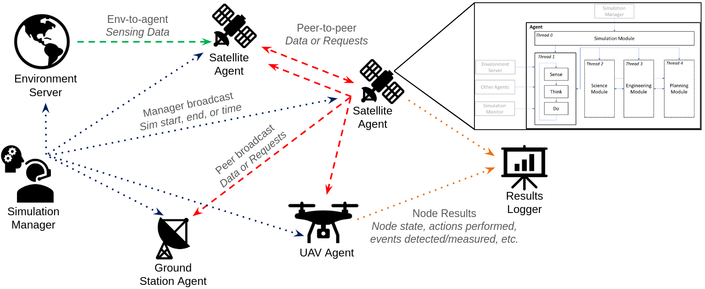

# Simulation Overview:

- A Ground Station agent generates and broadcast new tasks to all agents when in range.
- Sensing agents (Satellites and UAVs) receive task broadcasts and perform a task-assignment procedure using various planning strategies (i.e. MACCBBA)
- Sensing agents may geenrate new tasks throughout the simulation based on their measurements and announce them toall agents (PENDING)

# Simulation Architecture Description
## Manager:
In charge of keeping time in the simulation. 
- Listens for all agents to request a time to fast-forward to. 
- Once all agents have done so, the manager will perform a time-step increase in the simulation clock and announce the new time to every member of the simulation. 
- This will be repeated until the final time has been reached.

## Monitor:
Receive messages in real-time and inform user of simulation status (PENDING)

## Environment Server:
Is in charge of simulating the Earth-system in which the agents will live during the simulation. Can be sensed by the agents via REQ-REP messages. These senses may include information such as:

1. The sensing agent's own position or velocity
2. A Ground Point's measurement data

The environment server tracks the position and velocity of every satellite agent using precomputed orbital trajectories using `OrbitPy`.

Access-times between agents is also precomputed and broadcasted by the Environment Server. Connectivity between every satellite and ground station agent is precomputed using `OrbityPy`, whereas UAV agents are assumed to always be in range of the Ground Station agent.

The data being sensed by the agents when performing a measurement is precomputed (citation and development PENDING).

## Agent:

 
Agents consist of a main `live()` thread and a three modules. The `Engineering Module` is in charge of keeping track of an agent's components' states, as to simulate the physical aspects of the agent in question. The `Science Module` processes any incoming measurement information and creates new observation requests if it deems it necessary. The `Planning Module` is in charge of receiving said requests and scheduling them in the agent's operations plan. 

At each time-step, the agents' `live()` thread iterates through an internal `sense`->`think`->`do` loop, while the modules are constantly listening for incoming messages.

During the agents' `sense` routine, agents will inform their `Engineering Module` of any actions that were just performed along with the latest simulation time and any connectivity updates from the environment. This will instruct the `Engineering Module` to update its state. Agents will also listen for any message coming from other agents during the `sense` routine. If an environment message instructs the agent to alter its connectivity to other agents, it will do so by unsubscribing or subscribing to the PUB port of the desired agent.

Once all incoming transmissions are received, the agent will `think` its next set of actions to perform. It does so by sending all incoming agent messages to the `Planning` and `Science Module` and then waiting for a message containing its next plan. The `Science Module` will use this incoming information to update its internal models and possibly detect areas of interest that may need further observations. The `Planning Module` will then use these findings along with the messages from the parent agent to schedule its next set of tasks to do.

The agent enters its `do` routine as soon as a plan is received and starts to perform actions as instructed. Agents update their state at the beginning of each time-step as well as before and after an action is performed. If an action leads to the a failure state within the `Engineering Module`, the agent will shut down and inform the Manager. The status of completion of each action is tracked by the agent and then sent back to the `sense` routine, which repeats the an iteration of the `sense`->`think`->`do` loop.

### Agent State:
Represented as the state of the components and subsystems described in the `Engineering Module`, it characterizes the agent's position and velocity as well as the state of its internal components and the action being performed by the agent at a given time. The actions performed by an agent may be:
1. Idling
2. Traveling
3. Maneuvering
4. Messaging another agent
5. Waiting for a message
6. Performing a measurement

All agents are responsible of tracking their own state. The specifics of each state depend onf the type of agent. 

Satellite agents exist in a predefined orbit and are unable to change it. Their position and velocity is precalculated using the `OrbitPy` library, however they can perform slewing maneuvers to alter their orientation. Their `Engineering Module` contains ADCS, payload, and EPS subsystems.

UAV agents can move in any direction and at predefined a maximum speed. They possess a kinematic model that calculates their position during the simulation.  Their `Engineering Module` only contains the payload and EPS subsystems.

The Ground Station agent's state is much simpler and has unlimited internal resources. It does not track its posistion and velocity and is unable to perform measurements. It can only communicate with other agents and generate measurement requests.

#
## Measurement Task Description:
Measurement Tasks are defined by a tuple containing their:
1. Location (lat [°], lon [°], alt [km])
2. Max Reward (defined by the `Science Module`)
3. Start Time
4. End Time
6. List of Required Information
7. Task ID

This information will be shared to and amongst agents as `TaskRequest` messages. 

## Planners
Different planning strategies are to be tested with this platform along with various utility functions. 

### Naive Greedy Planner
Schedules observations in a greedy fashion by choosing the earliest next possible observation. Does NOT consider the predicted utility of performing said observation.